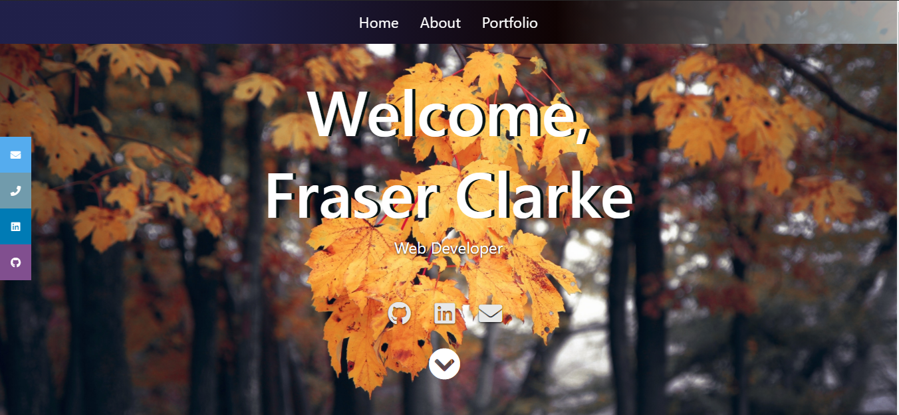

# React portfolio

- [Deployed GitHub Pages Link](https://fraserclarke.github.io/react-portfolio/)

> ## Description

- A Profile page created using react and deployed through gh-pages. A mobile first design with easy navigation.
- Contains some of my projects and applications created.
- Lists technologies/skills/tools used and contains links to my linkedIn, GitHub, and email.

* [Cick here to view](https://fraserclarke.github.io/react-portfolio/)

## Table of contents

- [Description](#Description)
- [Links](#Links)
- [General info](#general-info)
- [Screenshots](#Screenshots)
- [Questions](#Questions)
- [Credits](#Credits)

## Screenshots

<!--  -->

<!--  -->

## General info

#### User Story

- As an employer, I want to be able to view a profile page that is easy to navigate and find information with relevant corresponding links to either social media pages or sites that display their work.

## Questions

- GitHub username: FraserClarke
- [Github Link](https://github.com/FraserClarke)
- Email Address: clarkefraser1@gmail.com

## Links

- [Github Repository](https://github.com/FraserClarke/react-portfolio)

- [Deployed GitHub Pages Link](https://fraserclarke.github.io/react-portfolio/)

## Credits

- Created by: [Fraser Clarke](https://github.com/FraserClarke)
- This project was bootstrapped with [Create React App](https://github.com/facebook/create-react-app).
